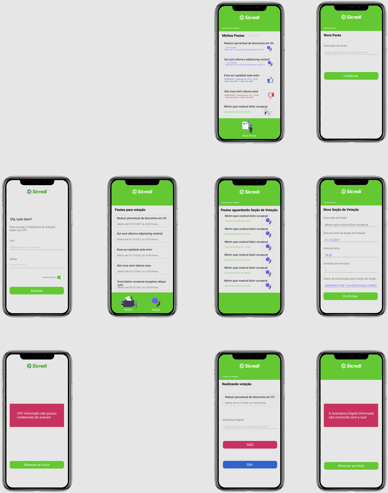
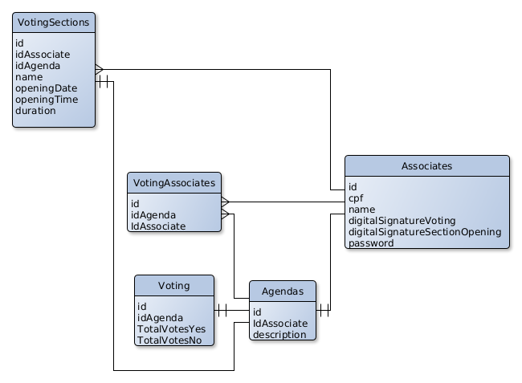

# VotingApp
---

## 💻 Sobre o projeto

API desenvolvida para atender requisitos do Desafio Técnico como parte do processo seletivo para provimento de vaga de Desenvolvedor Back-End.

---

## Decisões do Projeto

Para guiar a definição dos End-Points a serem disponibilizados pala API, uma proposição de interface foi elaborada.

Baseada nessa Proposta de Interface uma análise foi realizada e como conseguencia definidos os End-Points que a API disponibilizaria.

### Proposição de interface

 

 

### Análise de End-points para interface

 

 

### O Banco de Dados

A partir da Proposição de Interface e da análise dos End-Points que a API deveria prover, foi projetado uma estrutura de banco de dados que atendesse a essas necessidades e vislumbra-se detalhes importantes como: Desempenho, segurança e escalabilidade, privacidade do voto, autenticação de votação e permissão para criação de seção de votação.

 

 

---

## Autor

<a href="https://blog.rocketseat.com.br/author/thiago/">
 
  
 <b>Erton Sotero</b></a> 
  

---
